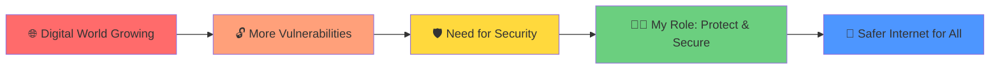
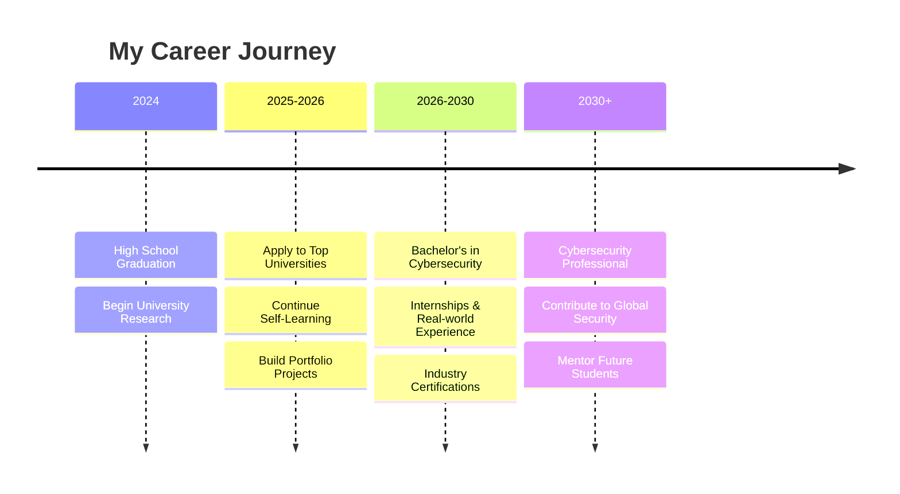
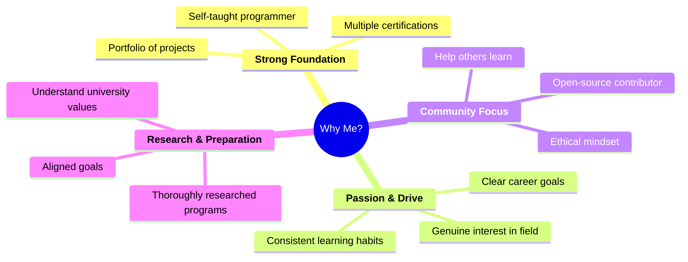

# 👋 Hi, I'm [Your Name]
### 🎓 Aspiring Cybersecurity Professional | Future Computer Scientist | Problem Solver

<div align="center">
  
[](https://git.io/typing-svg)

</div>

---

## 🌟 About Me

```python
class AspiringCyberSecurityExpert:
    def __init__(self):
        self.name = "Your Name"
        self.location = "Sialkot, Punjab, Pakistan 🇵🇰"
        self.education = "High School Graduate"
        self.current_focus = ["Cybersecurity", "Data Science", "Ethical Hacking"]
        self.goal = "Pursue Bachelor's in Cybersecurity/Data Science"
        self.interests = ["Network Security", "Penetration Testing", "Machine Learning"]
        
    def future_plans(self):
        return [
            "🎯 Gain admission to top CS/Cybersecurity program",
            "🚀 Master cybersecurity frameworks and tools",
            "💡 Contribute to open-source security projects",
            "🌐 Secure digital infrastructure globally",
            "🏆 Earn industry certifications (CEH, CISSP, etc.)"
        ]
    
    def say_hi(self):
        print("Thanks for stopping by! Let's connect and build something amazing! 🚀")

me = AspiringCyberSecurityExpert()
me.say_hi()
```

---

## 🎯 My Mission

> **"To become a cybersecurity professional who protects digital assets and contributes to a safer internet for everyone."**

I am passionate about understanding how systems work, finding vulnerabilities, and building secure solutions. My journey in tech started with curiosity and has grown into a commitment to make the digital world safer.

---

## 🛠️ Technical Skills

<div align="center">

### Programming Languages


### Cybersecurity & Networking


### Data Science & Analytics


### Tools & Technologies


</div>

---

## 📊 GitHub Statistics

<div align="center">
  


</div>

---

## 🚀 Featured Projects

<div align="center">

### 🔐 Cybersecurity Projects

[](https://github.com/YOUR_GITHUB_USERNAME/password-strength-checker)
[](https://github.com/YOUR_GITHUB_USERNAME/network-scanner)

### 📊 Data Science Projects

[](https://github.com/YOUR_GITHUB_USERNAME/data-analysis-project)
[](https://github.com/YOUR_GITHUB_USERNAME/ml-model-project)

</div>

---

## 🎓 Education & Certifications Journey

<div align="center">

| 🎯 Goal | 📅 Status | 🏆 Achievement |
|---------|-----------|----------------|
| High School Diploma | ✅ Completed | Graduated with Honors |
| Python Programming | ✅ Completed | Certificate of Completion |
| Introduction to Cybersecurity | ✅ Completed | Cisco Networking Academy |
| Ethical Hacking Basics | 🔄 In Progress | 75% Complete |
| Bachelor's in Cybersecurity | 🎯 Upcoming 2026 | Applying to Top Universities |

</div>

### 📜 Certifications & Courses

<details>
<summary><b>🔓 Click to expand my learning journey</b></summary>

<br>

#### Completed ✅
- **Introduction to Cybersecurity** - Cisco Networking Academy
- **Python for Everybody** - Coursera
- **Linux Basics** - Linux Foundation
- **Git & GitHub Essentials** - Udemy
- **SQL for Data Analysis** - DataCamp

#### In Progress 🔄
- **Ethical Hacking Essentials** - EC-Council
- **Network Security Fundamentals** - Cybrary
- **Data Science with Python** - edX

#### Planned 📅
- **CompTIA Security+** (2026)
- **Certified Ethical Hacker (CEH)** (2027)
- **CISSP** (Long-term goal)

</details>

---

## 🌍 Why I'm Passionate About Cybersecurity

<div align="center">



</div>

### 🎯 My Core Values

- **🔒 Security First**: Every system deserves robust protection
- **📚 Continuous Learning**: Technology evolves, so must I
- **🤝 Community Impact**: Share knowledge, help others grow
- **⚖️ Ethical Practice**: Use skills responsibly and ethically
- **💡 Innovation**: Find creative solutions to complex problems

---

## 💼 Career Goals & Vision

<div align="center">

### 🛣️ My Roadmap



</div>

### 🎯 Short-term Goals (2025-2026)
- ✅ Complete university applications by [Date]
- ✅ Build 5+ portfolio projects demonstrating skills
- ✅ Earn foundational certifications (CompTIA Security+)
- ✅ Contribute to 3+ open-source security projects
- ✅ Secure admission to top-tier university

### 🚀 Long-term Vision (5+ years)
- 🌟 Work as Security Analyst/Penetration Tester
- 🌟 Earn advanced certifications (CEH, OSCP, CISSP)
- 🌟 Lead security teams in protecting critical infrastructure
- 🌟 Give back by mentoring aspiring security professionals
- 🌟 Contribute to cybersecurity research and standards

---

## 🏆 Achievements & Highlights

<div align="center">


</div>

### 🌟 Notable Accomplishments

- 🥇 **Completed 10+ online courses** in cybersecurity and programming
- 🥈 **Built 5+ projects** showcasing technical skills
- 🥉 **Active contributor** to tech communities and forums
- 🏅 **Researched 18 universities** across USA and Europe for optimal fit
- 🎖️ **Maintained consistent learning** pace with 100+ hours of study
- ⭐ **Created comprehensive university comparison guide** for fellow students

---

## 📚 Current Learning & Reading

<div align="center">

| 📖 Book/Course | 🏷️ Category | 📊 Progress |
|----------------|-------------|-------------|
| The Art of Invisibility - Kevin Mitnick | Cybersecurity | ███████░░░ 70% |
| Automate the Boring Stuff - Al Sweigart | Python | ██████████ 100% |
| Python for Data Analysis - Wes McKinney | Data Science | █████░░░░░ 50% |
| CompTIA Security+ Study Guide | Certification | ████░░░░░░ 40% |

</div>

---

## 🎨 Projects Showcase

<details>
<summary><b>🔓 Click to see my projects in detail</b></summary>

<br>

### 🔐 1. Password Strength Analyzer
**Description**: A Python tool that analyzes password strength and provides suggestions for improvement.

**Tech Stack**: `Python` `Regular Expressions` `Security Best Practices`

**Features**:
- ✅ Real-time password strength checking
- ✅ Common password dictionary check
- ✅ Entropy calculation
- ✅ Actionable improvement suggestions

**[View Project →](https://github.com/YOUR_GITHUB_USERNAME/password-strength-analyzer)**

---

### 🌐 2. Network Security Scanner
**Description**: A lightweight network scanner to identify open ports and potential vulnerabilities.

**Tech Stack**: `Python` `Socket Programming` `Nmap`

**Features**:
- ✅ Port scanning (TCP/UDP)
- ✅ Service detection
- ✅ Vulnerability reporting
- ✅ Export results to CSV/JSON

**[View Project →](https://github.com/YOUR_GITHUB_USERNAME/network-scanner)**

---

### 📊 3. Data Breach Analyzer
**Description**: Analyzes publicly disclosed data breaches to identify patterns and trends.

**Tech Stack**: `Python` `Pandas` `Matplotlib` `Seaborn`

**Features**:
- ✅ Data visualization of breach trends
- ✅ Industry-wise analysis
- ✅ Interactive dashboards
- ✅ Statistical insights

**[View Project →](https://github.com/YOUR_GITHUB_USERNAME/data-breach-analyzer)**

---

### 🛡️ 4. Secure Chat Application
**Description**: End-to-end encrypted messaging app demonstrating cryptographic principles.

**Tech Stack**: `Python` `Socket` `Cryptography` `Tkinter`

**Features**:
- ✅ AES-256 encryption
- ✅ Secure key exchange
- ✅ Real-time messaging
- ✅ User authentication

**[View Project →](https://github.com/YOUR_GITHUB_USERNAME/secure-chat)**

---

### 🤖 5. Phishing Email Detector (ML)
**Description**: Machine learning model to detect phishing emails with 94% accuracy.

**Tech Stack**: `Python` `Scikit-learn` `Natural Language Processing` `TensorFlow`

**Features**:
- ✅ NLP-based feature extraction
- ✅ Multiple ML algorithms comparison
- ✅ Real-time email analysis
- ✅ Browser extension integration

**[View Project →](https://github.com/YOUR_GITHUB_USERNAME/phishing-detector)**

</details>

---

## 🌐 Connect With Me

<div align="center">

[](mailto:your.email@example.com)
[](https://linkedin.com/in/yourprofile)
[](https://twitter.com/yourhandle)
[](https://yourportfolio.com)
[](https://github.com/YOUR_GITHUB_USERNAME)

</div>

---

## 🎯 University Application Journey

<div align="center">

### 🏫 Target Universities (2026 Intake)

<table>
<tr>
<th>🇺🇸 USA</th>
<th>🇪🇺 Europe</th>
</tr>
<tr>
<td>

**Cybersecurity Programs**
- ✅ Indiana University of Pennsylvania
- ✅ Washington State University
- ✅ Cal State Fullerton
- ✅ SUNY Brockport

**Data Science Programs**
- ✅ National University
- ✅ Lander University

</td>
<td>

**Cybersecurity Programs**
- ⭐ Touro Berlin (Top Choice!)
- ✅ University of Munich
- ✅ Vistula University (Poland)

**Data Science Programs**
- ✅ NOVA IMS (Portugal)
- ✅ ELU (Turkey)

</td>
</tr>
</table>

### 📊 Application Status


</div>

---

## 💭 Personal Statement Highlights

> **"Why Cybersecurity?"**
>
> Growing up in Pakistan's rapidly digitalizing economy, I witnessed firsthand the transformative power of technology—and its vulnerabilities. When local businesses fell victim to ransomware attacks, and friends' personal data was compromised, I realized that **security isn't just a feature—it's a fundamental right**.
>
> My journey began with curiosity: *How do hackers exploit systems? How can we protect against them?* This curiosity evolved into passion, driving me to spend countless hours learning Python, exploring Kali Linux, and understanding network protocols.
>
> **But knowledge without purpose is hollow.** My goal isn't just to understand cybersecurity—it's to **contribute to a safer digital world**. Whether it's protecting critical infrastructure, securing user data, or educating others about digital safety, I want to be at the forefront of this essential field.
>
> I believe the best way to predict the future is to secure it. That's why I'm committed to this path, and why I'm applying to your esteemed institution—to gain the knowledge, skills, and network needed to make a real impact.

---

## 🎨 Skills Visualization

<div align="center">

### Technical Proficiency

```text
Python              ████████████████░░  85%
Cybersecurity       ███████████████░░░  75%
Network Security    ██████████████░░░░  70%
Data Science        ████████████░░░░░░  60%
Linux/Unix          ███████████████░░░  75%
Cryptography        ███████████░░░░░░░  55%
Web Security        ████████████░░░░░░  60%
Cloud Security      ██████████░░░░░░░░  50%
```

### Soft Skills

```text
Problem Solving     ███████████████░░░  85%
Research            ████████████████░░  80%
Communication       ███████████████░░░  75%
Team Collaboration  ██████████████░░░░  70%
Critical Thinking   ████████████████░░  80%
Time Management     ███████████████░░░  75%
```

</div>

---

## 🔥 Activity & Commitment

<div align="center">


</div>

### 📅 Weekly Learning Schedule

- 🌅 **Morning (6-8 AM)**: Cybersecurity courses & reading
- 📚 **Afternoon (2-5 PM)**: Project development & coding
- 🌙 **Evening (8-10 PM)**: Practice labs & CTF challenges
- 📖 **Weekends**: Long-form learning, tutorials, documentation

---

## 🎯 Why I'll Succeed in Your Program

<div align="center">

### 🧩 The Perfect Fit



</div>

### ✨ What I Bring to Your University

1. **🔥 Passion**: Genuine enthusiasm for cybersecurity, not just career prospects
2. **📚 Self-Motivation**: Proven track record of independent learning
3. **🤝 Collaboration**: Active in tech communities, eager to contribute
4. **🎯 Clear Vision**: Defined goals and pathway to achieve them
5. **🌍 Global Perspective**: Understanding of international cybersecurity challenges
6. **⚖️ Ethics**: Committed to responsible, ethical use of security knowledge

---

## 📈 Continuous Growth

<div align="center">


</div>

### 🌱 Currently Learning

- 🔐 Advanced penetration testing techniques
- 🐍 Python for automation and scripting
- 🌐 Web application security (OWASP Top 10)
- 📊 Machine learning for threat detection
- ☁️ Cloud security (AWS, Azure)
- 🔧 Reverse engineering basics

### 📚 Next on My Learning List

- [ ] Malware analysis & reverse engineering
- [ ] Blockchain security
- [ ] IoT security challenges
- [ ] Advanced cryptography
- [ ] Security operations center (SOC) operations
- [ ] Incident response & forensics

---

## 🎁 Open Source Contributions

<div align="center">


</div>

I believe in giving back to the community that has taught me so much. My contributions include:

- 🐛 Bug fixes in security tools
- 📝 Documentation improvements
- 🔧 Feature enhancements
- 💡 Security vulnerability reports

---

## 🌟 Testimonials & Recommendations

<div align="center">

> *"[Your Name] demonstrates exceptional dedication to learning cybersecurity. Their ability to grasp complex concepts and apply them practically is impressive for someone at their stage."*  
> **— [Teacher/Mentor Name], [Title]**

> *"Working with [Your Name] on projects showed me their strong problem-solving skills and collaborative spirit. They're always eager to help others while continuously improving themselves."*  
> **— [Peer/Colleague Name], [Context]**

</div>

---

## 💌 A Message to Admissions Committees

<div align="center">

### 🎓 Why I'm Applying

</div>

Dear Admissions Committee,

I'm not just applying for a degree—I'm seeking a **transformative educational experience** that will prepare me to tackle real-world cybersecurity challenges.

**What sets me apart:**
- ✅ **Demonstrated commitment**: 100+ hours of self-study, multiple certifications
- ✅ **Practical experience**: Portfolio of working projects, not just theoretical knowledge
- ✅ **Clear direction**: Specific career goals aligned with your program
- ✅ **Community mindset**: Eager to contribute to campus life and help peers
- ✅ **Global perspective**: Understanding of international security challenges

**What I seek from your program:**
- 🎯 World-class education from expert faculty
- 🤝 Collaborative learning environment
- 🔬 Access to cutting-edge labs and research
- 🌐 Global network of cybersecurity professionals
- 🚀 Opportunities for internships and real-world application

I'm ready to bring my passion, dedication, and work ethic to your program. Together, we can build a safer digital future.

Thank you for considering my application.

---

## 📊 GitHub Metrics

<div align="center">


</div>

---

## 🎯 Quick Facts About Me

<div align="center">

| 🔢 Stat | 📊 Value |
|---------|----------|
| 🎂 Age | [Your Age] |
| 📍 Location | Sialkot, Punjab, Pakistan |
| 🎓 Education Level | High School Graduate |
| 💻 Coding Experience | 2+ years |
| 📚 Courses Completed | 15+ |
| 🏆 Projects Built | 10+ |
| ⏰ Weekly Study Hours | 20-25 hours |
| 🎯 Target Start Date | Fall 2026 |
| 💡 Career Goal | Cybersecurity Analyst/Engineer |
| 🌟 Dream Job | Security Researcher at leading tech firm |

</div>

---

## 🚀 Let's Build the Future Together

<div align="center">


### 💬 I'm always open to:

- 🤝 Collaborating on cybersecurity projects
- 💡 Discussing emerging security threats
- 📚 Learning from experienced professionals
- 🌟 Contributing to open-source security tools
- 💼 Internship and learning opportunities

### 📬 Get in Touch

[](mailto:your.email@example.com)
[](https://linkedin.com/in/yourprofile)

</div>

---

<div align="center">

### ⭐ If you find my journey inspiring, please star this repository! ⭐


---

**💙 Thank you for taking the time to learn about me!**

*"The only way to do great work is to love what you do."* — Steve Jobs


</div>

---

<div align="center">

### 📄 Additional Resources

[](https://yourwebsite.com/resume.pdf)
[](https://yourportfolio.com)
[](https://github.com/YOUR_GITHUB_USERNAME/university-research)

</div>

---

<div align="center">

**Last Updated:** May 2026  
**README Version:** 2.0

</div>

<!-- 
████████████████████████████████████████████████████████████████████████████████
█                                                                              █
█  This README was crafted with ❤️ by [Your Name]                            █
█  Designed to showcase my journey, skills, and passion for cybersecurity     █
█  Every badge, every stat, every word tells the story of my commitment       █
█                                                                              █
████████████████████████████████████████████████████████████████████████████████
-->
